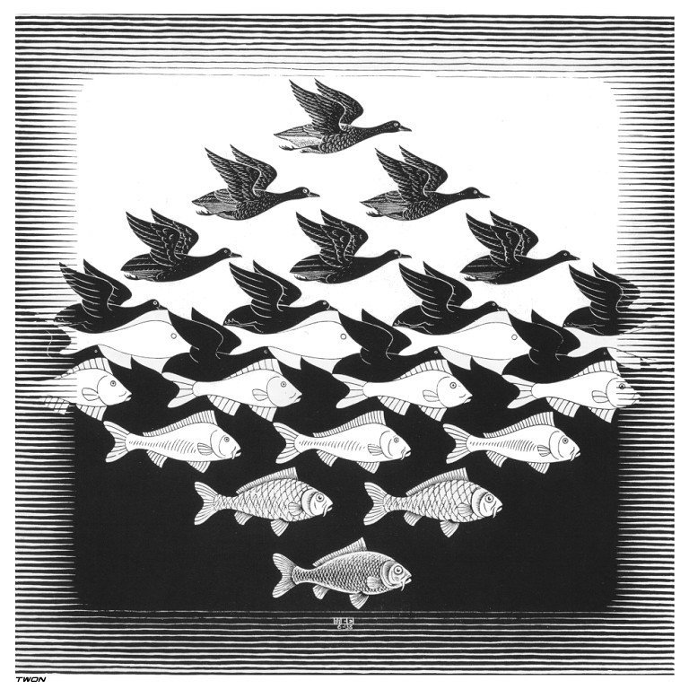

## About Me

Computer Science undergrad at @ufscar and Data Science Intern at [BigData](https://www.linkedin.com/company/big-data-brasil-/), currently working on forecasting pipelines and data analysis. I like to design and automate things. 

---------

### Technologies

- **Programming Languages:** [Python](https://www.python.org/), [Julia](https://julialang.org/), C++
- **Machine Learning:** [Scikit-Learn](https://scikit-learn.org/stable/index.html), [Keras](https://keras.io/), [Optuna](https://optuna.org/), [Flux.jl](https://fluxml.ai/Flux.jl/stable/)
- **Data Analysis:** [Pandas](https://pandas.pydata.org/), [Matplotlib](https://matplotlib.org/), [Jupyter Notebooks](https://jupyter.org/), [DataFrames.jl](https://dataframes.juliadata.org/stable/), [Makie](https://makie.juliaplots.org/stable/)
- **Tools:** [NeoVim](http://neovim.io/), [tmux](https://github.com/tmux/tmux), [Obsidian](https://obsidian.md/)
- **Others:** LaTeX, Fedora Silverblue

---------

### Projects

- [Multi-ensemble Machine Learning based approach for Short-term Solar Radiation Forecasting](https://github.com/lfenzo/ml-solar-sao-paulo)

---------

"Sky and Water" *by M. C. Escher (xylography, 1938)*
